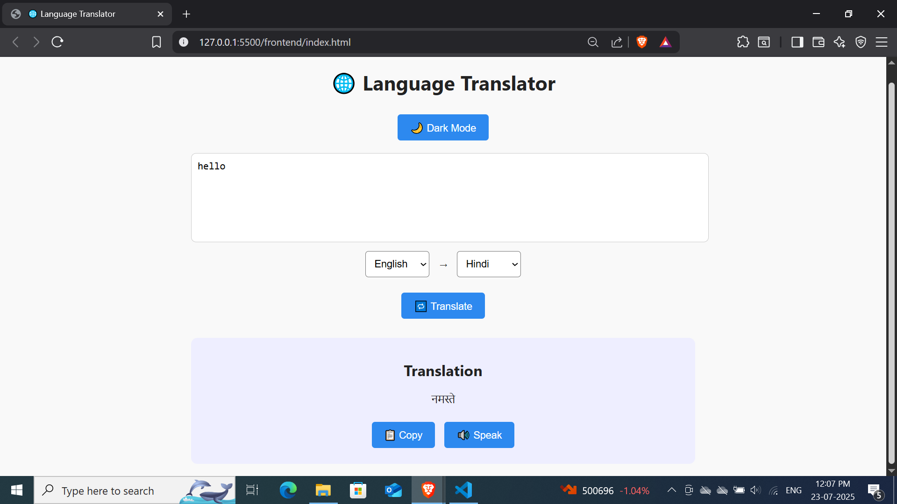

# Language Translation Tool

## Overview
This project is a **Language Translation Tool** developed as part of the Artificial Intelligence Internship at CodeAlpha. It allows users to input text and translate it between multiple languages using the MyMemory Translation API.

---

## Features
- Input text with source language selection or auto-detection  
- Select target language for translation  
- Display translated text clearly  
- Copy translated text to clipboard  
- Text-to-speech (TTS) support for translated text  
- Dark mode toggle for better user experience

---

## Technology Stack
- Frontend: HTML, CSS, JavaScript (React.js optional)  
- Backend: Node.js, Express.js  
- Translation API: MyMemory Translation API  
- Other libraries: Text-to-Speech Web API

---

## How to Use
1. Clone the repository  
git clone https://github.com/Gauravg2630/CodeAlpha_Projects/tree/main/CodeAlpha_LanguageTranslationTool.git

2. Navigate to the project directory  
cd CodeAlpha_Projects/tree/main/CodeAlpha_LanguageTranslationTool

3. Install dependencies (if applicable)  
npm install

4. Run the backend server  
node server.js

5. Open `index.html` in your browser or start frontend server (React apps)  

6. Enter text, select languages, and get translations instantly!

---

## Demo Screenshot

---

## Future Improvements
- Add support for more translation APIs (Google, Microsoft)  
- Improve UI responsiveness and accessibility  
- Add user authentication to save translation history

---

## Acknowledgements
Thanks to CodeAlpha for the internship opportunity and guidance throughout this project.

---

## License
This project is licensed under the MIT License.
